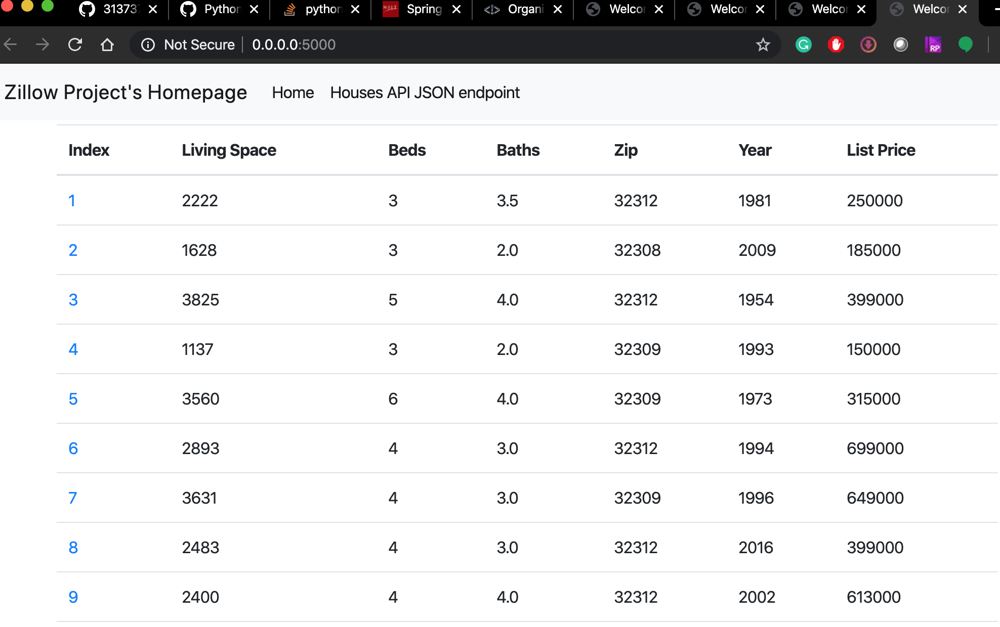
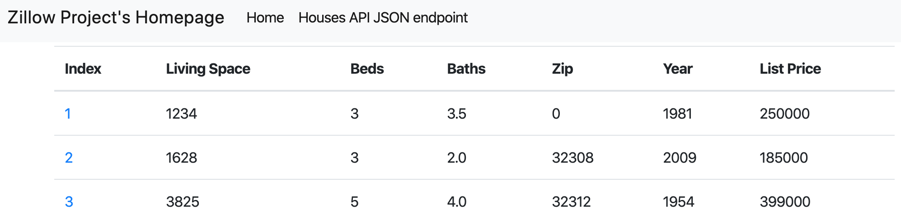
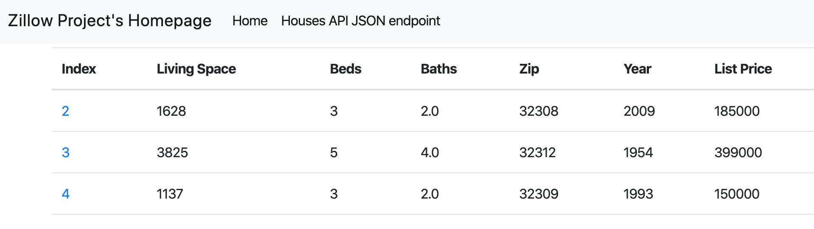

# Project Description
This project is my final project part 1 and 2. 

#Part 1

## New Data Output

## Homepage

## Add Data

Added at bottom row

## Change Data

## Delete Data

## API Load

# Part 2
 ## Postman Browse

## Add Data

## API Load

