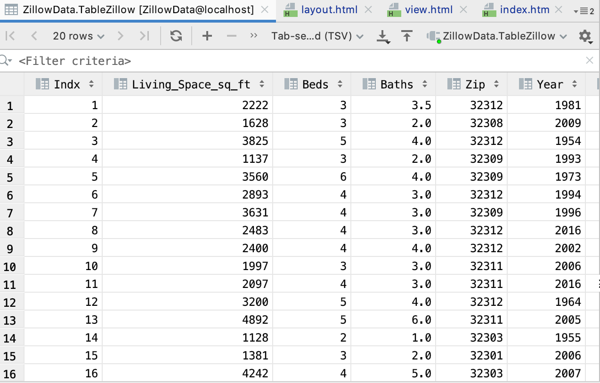

# Project Description
This project is a homework assignment to teach how to get Pycharm setup with Docker, Flask, MySQL, and Postman

# Postman Screenshot

# SQL Data Screenshot

# HTML Screenshot

# New Data Output

# Homepage

# Add Data

# Change Data

# Delete Data

